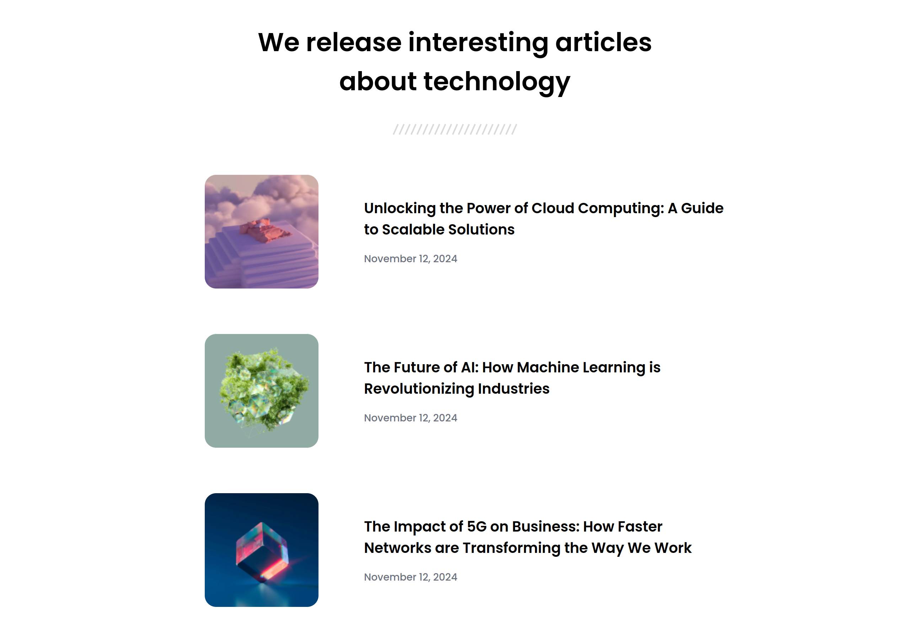

# Simple Article Listing

This is a small project I made to train with HTML, CSS and Flexbox.

## Table of Content

  - [Overview](#overview)
    - [Description](#description)
    - [Screenshot](#screenshot)
    - [Links](#links)
  - [My process](#my-process)
    - [Built with](#built-with)
    - [What I learned](#what-i-learned)
    - [Continued Development](#continued-development)
    - [Useful Resources](#useful-resources)
  - [Author](#author)
  - [Acknowledgments](#acknowledgments)

## Overview

### Description

I present to you a small project I made. The main objective was to work with HTML, CSS and Flexbox to perfect my knowledge with those technologies.
It consist of a simple article listing containing a header and a main with three article, each containing an image, a title and a date of publication.
This project works on all device, from smartphone to desktop computer !

### Screenshot



### Links

  - [Live Site](https://sephydev.github.io/simple-article-listing/)

## My process

### Built with

  - Semantic HTML5
  - CSS
  - Flexbox

### What I learned

Thanks to this project, I've practiced some semantic HTML, CSS and Flexbox. The following snippets are some examples of the knowledges I used.

  - Semantic HTML5 (```<header>```):

```
    <header>
      <h1>We release interesting articles about technology</h1>
       
    </header>
```

  - CSS (```<h1>```):
```
h1 {
  font-size: 2.25rem;
  text-align: center;
  font-weight: 600;
  max-width: 35rem;
  margin: 2rem auto;
}
```

  - Flexbox (```<div>```):

```
div {
  display: flex;
  flex-direction: column;
  max-width: 32rem;
  gap: 1rem;
}
```

### Continued Development

Seeing how Flexbox is useful, I will continue to master this technologie.
I will do that by using it on other project, notably to make responsive design.

### Useful Resources

  - [Guide to Flexbox](https://css-tricks.com/snippets/css/a-guide-to-flexbox/)

## Author

  - Website : Sephydev

## Acknowledgment

Thanks to my friends and my family for supporting me while I journey in the land of Web Development, and during the making of this project !